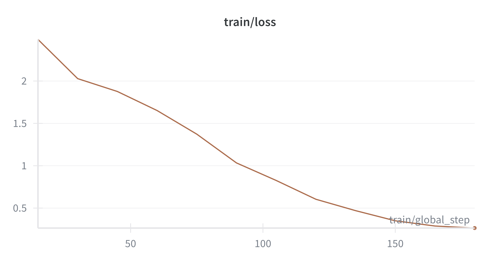

# finetune-merged-lora-model-peft

<p align="center">
  
  
  
  
  
  
  
  
  
  
  
</p>

## Overview
This repository is my **collection of end-to-end fine-tuning notebooks** (LoRA / QLoRA-style) using the modern Hugging Face stack.
It includes examples across model families and sizes (Phi, Gemma, DialoGPT, SmolLM, DeepSeek distills), plus an example W&B training chart from one of my fine-tuning runs.

## Contents
- **Notebooks**: Fine-tuning runs (4-bit) + adapter/merge flows.
- **Assets**: Example training results (W&B chart exports). Hugging Face login helpers.

## Repo structure
```text
.
├── assets/
│   └── wandb/
│       └── wandb-chart-2026-01-29-235217.png
├── fine_tune_*.ipynb
├── finetune_*.ipynb
└── README.md
```

## Tech stack
- **Core**: PyTorch, Transformers, PEFT, TRL
- **Efficiency**: bitsandbytes (4-bit), Accelerate
- **Experiment tracking**: Weights & Biases (W&B)
- **Authoring**: Jupyter / Colab-style notebooks

## Notebooks (high level)
This repo contains multiple fine-tuning notebooks, including:
- **Microsoft Phi**
  - `fine_tune_microsoft_phi_1_4bit.ipynb`
  - `fine_tune_Lora_microsoft_Phi_3_mini_4k_instruct_4bit.ipynb`
  - `finetune_LoRA_Phi_3_mini_4k.ipynb`
  - `finetune_LoRA_Phi_3_mini_4k_raw_text.ipynb`
- **Google Gemma**
  - `fine_tune_google_gemma_3_270m_4bit.ipynb`
  - `fine_tune_Lora_google_gemma_2_2b_it_4bit.ipynb`
- **DialoGPT**
  - `fine_tune_Lora_microsoft_DialoGPT_medium_4bit.ipynb`
  - `fine_tune_Lora_microsoft_DialoGPT_small_4bit.ipynb`
  - `fine_tune_Lora_microsoft_DialoGPT_small_4bit (1).ipynb`
- **SmolLM**
  - `fine_tune_Lora_HuggingFaceTB_SmolLM_360M_Instruct_4bit.ipynb`
- **DeepSeek distill**
  - `fine_tune_deepseek_ai_DeepSeek_R1_Distill_Qwen_1_5B_4bit.ipynb`

## Example training result (W&B export)
Below is a W&B training chart export from my **`Llama-3.2-3B-ChatGPT-Prompts-Instruct`** fine-tuning run:



## Quickstart (recommended pattern)
Most notebooks follow this flow:
1. Install dependencies
2. Load base model + tokenizer
3. Configure 4-bit quantization (bitsandbytes)
4. Apply LoRA (PEFT)
5. Train (TRL / SFTTrainer)
6. Save adapter / merge / export
7. (Optional) Push artifacts to Hugging Face Hub (use env-based auth)

